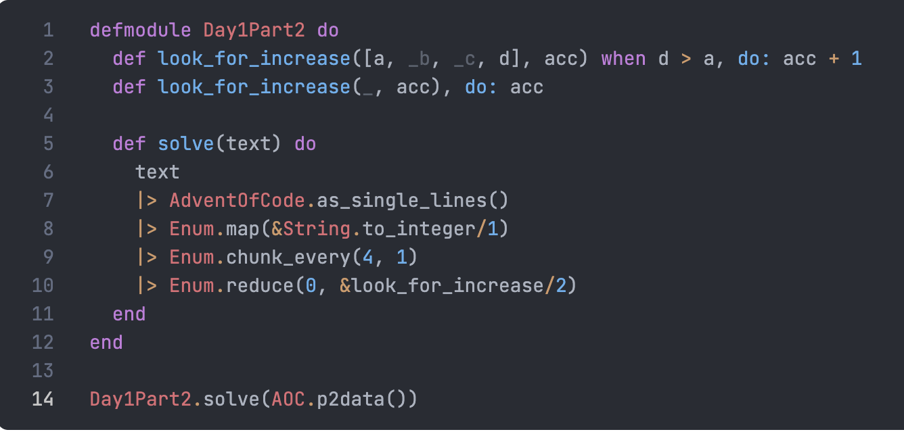
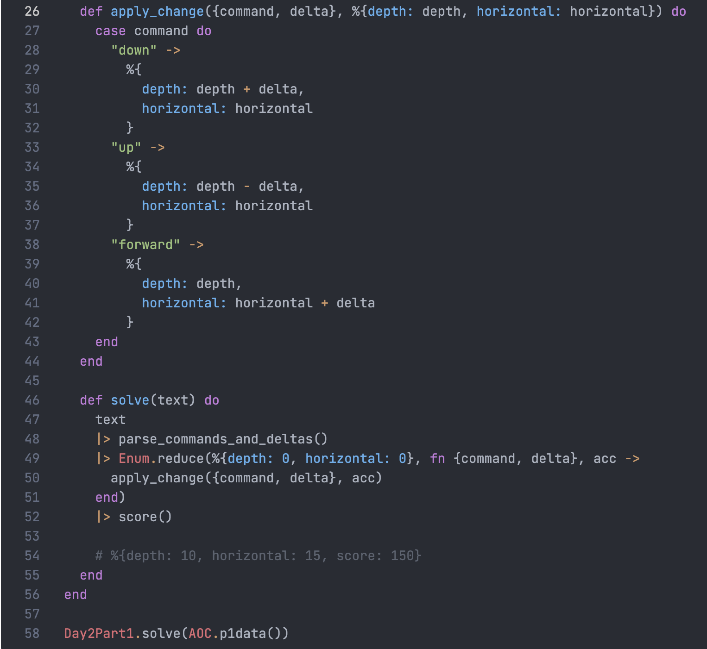
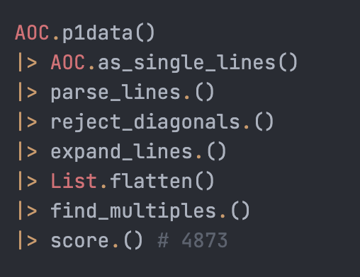
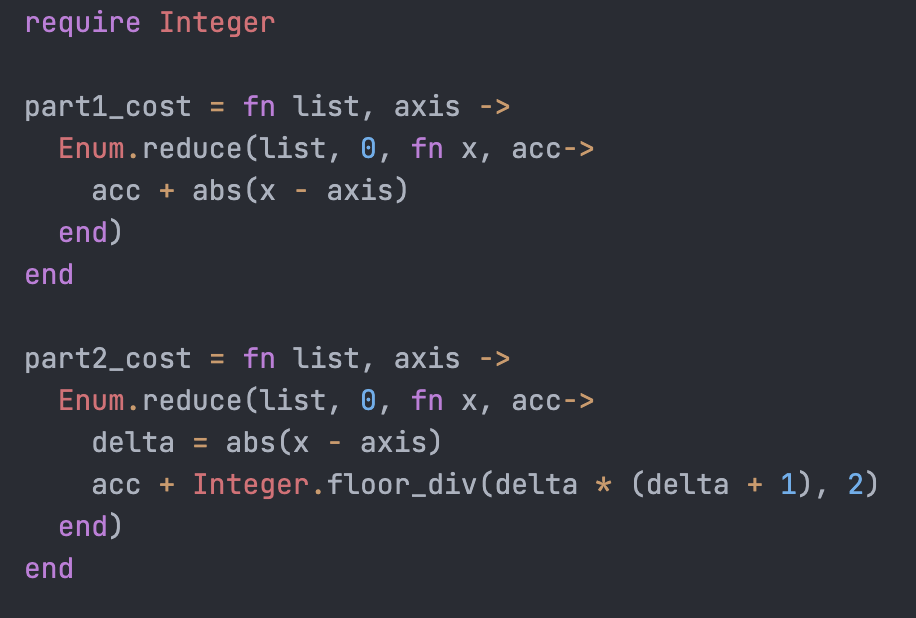

## LiveBook for AdventOfCode 2021

### To Run It
Prepare your machine just like you'd prep it for any
[Phoenix](https://www.phoenixframework.org/) app
(but it is a [LiveBook](https://livebook.dev/) app).

Run this on the command line:
```
mix phx.server
```

And then follow these steps:
1. Open [http://localhost:4000](http://localhost:4000)
1. Navigate to the 2021adventOfCode directory
1. Select the day you want
1. Press the OPEN button
1. Edit and it will auto-save
1. Solve the puzzle
1. `git commit -am 'Solved day NN!'`

### To Start The Next Day's Puzzle
`cp template.livemd 2021adventOfCode/dayNN.livemd`

Then just edit it [in the app](http://localhost:4000).

<!-- Do not remove this section or server.ex will break. -->
<!-- Environment variables -->
<!-- Environment variables -->
<!-- And, oddly enough, it needs to be twice -->

### Puzzle Answer Images
These are the ones I like.

* Day 1 Part 2


* Day 2 Part 1


* Day 5 Part 1


* Day 6 Cost Equations

